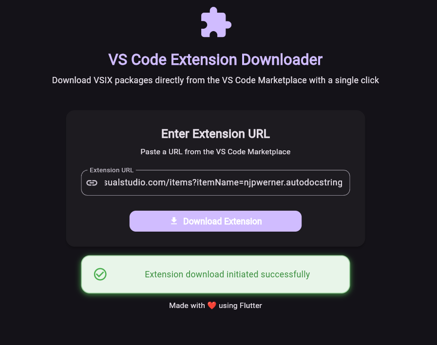

# VSIX Downloader

A Flutter web application that allows users to directly download VS Code extensions (VSIX packages) from the Visual Studio Code Marketplace with a single click.




Live Demo: https://not-dhanraj.github.io/vsix_downloader/

## How It Works

1. Copy a VS Code extension URL from the Marketplace 
2. Paste the URL
3. Click "Download Extension"
4. The VSIX package will be downloaded automatically

## Use Cases

- Download extensions for offline installation in VS Code or in VSCodium
- Install extensions on machines without direct internet access
- Create a local repository of extensions for enterprise environments

## Getting Started

### Prerequisites

- Flutter SDK (version 3.0.0 or higher)
- Chrome or Edge browser for web development

### Running the Application

1. Clone this repository:
   ```bash
   git clone https://github.com/Not-Dhanraj/vsix_downloader.git
   ```

2. Navigate to the project directory:
   ```bash
   cd vsix_downloader
   ```

3. Get dependencies:
   ```bash
   flutter pub get
   ```

4. Run the application:
   ```bash
   flutter run -d chrome
   ```

### Building for Production

To build a release version of the web app:

```bash
flutter build web --release
```

The built application will be available in the `build/web` directory.

## Contributing

Contributions are welcome! Please feel free to submit a Pull Request.

1. Fork the repository
2. Create your feature branch (`git checkout -b feature/amazing-feature`)
3. Commit your changes (`git commit -m 'Add some amazing feature'`)
4. Push to the branch (`git push origin feature/amazing-feature`)
5. Open a Pull Request

## License

This project is licensed under the MIT License - see the [LICENSE](LICENSE) file for details.

---

Made with ❤️ using Flutter
